# 股票投研 Agent 系统设计规范

- **日期**: 2026-06-18
- **状态**: Proposed
- **核心定位**: 针对 Sicong 的私人投资教练 Agent。主动给出"买什么、为什么、怎么买、买了后做什么、变化后做什么、何时卖"的全生命周期投资建议。支持美股 + A 股双市场。

---

## 目录

| 章节 | 标题 | 内容 |
|---|---|---|
| **1** | 系统概述 | 设计目标、核心原则 |
| **2** | 架构总览 | 同心圆三层、双循环、Market Adapter |
| **3** | L1-L7 数据层 | 七层记忆架构、各层定义、数据格式 |
| **4** | Market Adapter 层 | 双市场配置、数据/交易适配器、叙事领袖 |
| **5** | Prompt 层 — 4 个 Agent | 漏斗式研究、CoT 决策、操作分析、交易执行 |
| **6** | Context 层 | RAG 检索、上下文装配、快速反馈、证据等级 |
| **7** | Harness 层 | Guardrails、共识门禁、慢循环工作流、投资建议书 |
| **8** | 业务生命周期 | 买入/持仓/卖出全流程 |
| **9** | 投资决策质量鱼骨图 | 质量因素分析与对策 |
| **10** | Sicong 强纠错保护 | 二次确认、盲区检测、纪律评分 |
| **11** | 人工确认门禁清单 | 11 类确认触发条件 |
| **12** | Obsidian Vault 目录 | 存储结构设计 |
| **13** | 数据源完整清单 | 美股 + A 股数据源 |
| **14** | 系统验证与测试 | 单元/联调/多市场/安全测试 |
| **15** | 回测模式 | Point-in-Time 回测、事件驱动、性能评估 |
| **16** | 策略修正机制 | 即时/操作后/回测/季度策略审视 |

---

## 1. 系统概述

### 1.1 设计目标

本系统是一个基于 LLM 的私人投资教练，核心能力包括：

1. **全生命周期投资建议**：从选股到买入到持仓监控到卖出，覆盖完整投资闭环
2. **产业链深度研究**：通过 C0-C4 五层产业链拆解，找到真正的卡脖子环节
3. **证据驱动决策**：所有事实标注证据等级（A/B/C/D），杜绝无来源结论
4. **自我辩论共识**：单 Agent 通过 CoT 正反双方辩论，达成共识后才推送建议
5. **快速反馈学习**：拒绝原因即时回写 Context，系统从每次错误中学习
6. **双市场适配**：美股 + A 股，一套核心逻辑 + 两套市场配置

### 1.2 核心设计原则

| 原则 | 说明 |
|---|---|
| **投资建议优先** | 产业链研究是生产投资建议的前置过程，最终产出是投资建议 |
| **少即是多** | 4 个 Agent，五段式单次调用，CoT 自我辩论——减少信息传递损耗 |
| **上下文质量 > 流程严谨** | 80% 精力投入 Context 层，15% Prompt 层，5% Guardrails |
| **市场差异在 Context 层** | Agent 核心逻辑市场无关，差异由 Market Adapter + 配置注入 |
| **快速反馈** | 拒绝原因即时回写 Context，比任何 Guardrails 都有效 |

---

## 2. 架构总览

### 2.1 同心圆三层架构

系统采用同心圆三层架构：Prompt（内层）→ Context（中层）→ Harness（外层），底层由 L1-L7 数据层支撑，中层通过 Market Adapter 实现多市场适配。

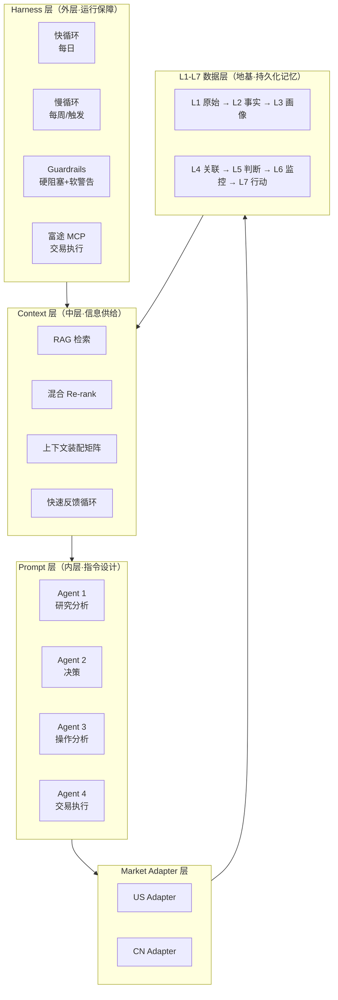

### 2.2 双循环设计

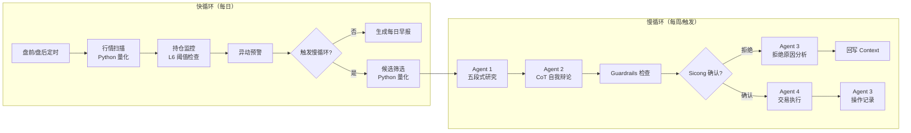

| 循环 | 频率 | 触发条件 | 核心流程 |
|---|---|---|---|
| **快循环** | 每日 | 定时（盘前/盘后） | 行情扫描 → 持仓监控 → L6 阈值检查 → 异动预警 |
| **慢循环** | 每周/触发式 | 快循环触发 / Sicong 请求 / 财报发布 | 候选筛选 → 研究分析 → 决策辩论 → Guardrails → Sicong 确认 → 执行 |

---

## 3. L1-L7 数据层

### 3.1 七层记忆架构

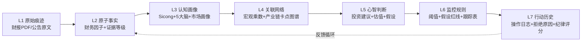

### 3.2 各层定义

| 层级 | 定位 | 数据载体 | 写入权限 | 关键字段 |
|---|---|---|---|---|
| **L1** | 原始痕迹层 | 财报 PDF 切片、K线数据、公告原文、调研纪要原文 | 全自动 | source, date, market |
| **L2** | 原子事实层 | 标准财务因子、宏观指标 | 全自动 | **evidence_level (A/B/C/D)**, source_anchor |
| **L3** | 认知画像层 | sicong.md + 5 个大脑模型 + 市场画像 | 人工授权 | profile_type, blind_spots |
| **L4** | 关联网络层 | 宏观传导乘数、供应链图谱、产业链卡点图谱 | 人工配制/自动 | **bottleneck_map** |
| **L5** | 心智与价值判断 | 投资建议、估值、假设、底层逻辑三问 | 人类门禁 | **logic_3q**, **c0_c4_position** |
| **L6** | 监控与规则触发 | 估值偏离阈值、假设红线、未来两季度跟踪表 | 人工授权 | **tracking_table** |
| **L7** | 行动与交易历史 | 每笔操作日志、复盘评价、拒绝原因、纪律评分 | 全自动写/手动录 | **rejection_reason** |

### 3.3 L2 原子事实格式

```markdown
### 事实条目
- 内容: 2025Q4 营收 50.2 亿美元，同比 +18.3%
- 证据等级: A
- 来源: [2025年报#P12](file:///vault/L1_raw/AAPL/2025-annual-report.pdf#P12)
- 日期: 2026-02-15
- market: US
```

### 3.4 L7 操作记录格式

```markdown
# 操作记录 AAPL-BUY-2026-06-18

## 基本信息
- 操作类型: 买入
- 标的: AAPL  价格: $148  数量: 100股  仓位占比: 8%
- 共识等级: 🟡 有条件共识
- market: US

## 决策背景
- 系统建议: 分两批买入（首批 5%，第二批 3%）
- Sicong 实际决定: 一次性买入 8%
- 违规标记: ❗ 未按建议执行

## 买入时锁定的假设红线 (L6)
- Q3 营收增速必须 > 10%
- 毛利率不低于 43%
- 止损线: $138

## 拒绝原因记录
- 日期: 2026-06-10
- 拒绝提案: 买入 NVDA
- 拒绝原因: "估值过于乐观，WACC 假设不合理"
- 回写 Context: ✅ 已注入下次 NVDA 分析的 Context

## 复盘评价
- 3个月后价格: $175（+18.2%）
- 假设是否被证伪: 否
- 经验/教训: 验证了"低估值+财报超预期"策略有效
```

---

## 4. Market Adapter 层

### 4.1 架构设计

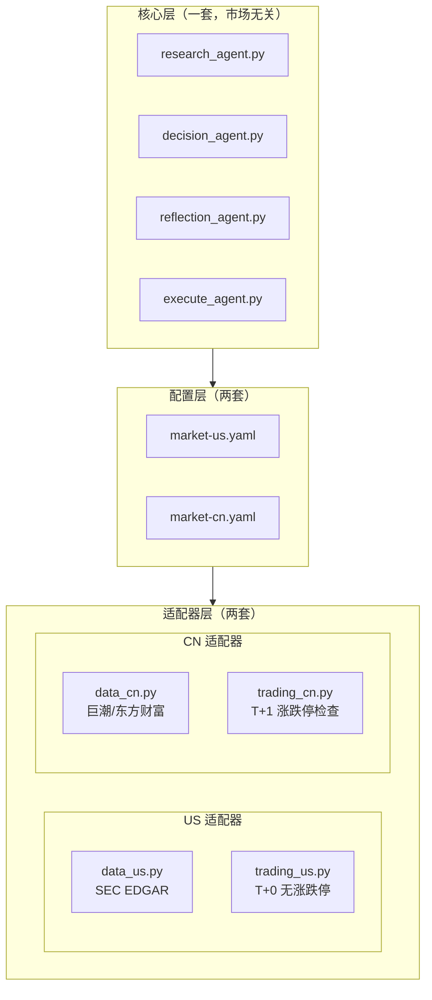

**设计原则**：90% 逻辑共享，改一次两个市场都生效。10% 不同的部分用配置 + 适配器处理。

### 4.2 美股市场配置

```yaml
# config/market-us.yaml
market: US
accounting_standard: US_GAAP
currency: USD
settlement: T+0
daily_limit: none
short_selling: allowed
valuation_preference:
  primary: DCF
  secondary: PEG
  policy_premium: low
key_metrics: [EPS, FCF, Revenue_Growth, PEG, P_E]
data_sources:
  filings: SEC_EDGAR
  market_data: Yahoo_Finance
  holdings: 13F
  earnings_call: Seeking_Alpha
special_rules: []
narrative_leaders:
  - name: "黄仁勋"
    alias: ["老黄", "Jensen"]
    narrative: "AI算力/GPU/芯片"
  - name: "孙宇晨"
    alias: ["孙哥", "Justin Sun"]
    narrative: "加密货币/叙事炒作"
  - name: "特朗普"
    alias: ["Trump"]
    narrative: "政策/宏观/地缘政治"
```

### 4.3 A 股市场配置

```yaml
# config/market-cn.yaml
market: CN
accounting_standard: China_ASBE
currency: CNY
settlement: T+1
daily_limit:
  main_board: 0.10
  star_board: 0.20
  chinext: 0.20
short_selling: restricted
valuation_preference:
  primary: PE_Band
  secondary: PB_Band
  policy_premium: high
key_metrics: [营收增速, 净利润, ROE, 毛利率, 北向资金, 融资融券]
data_sources:
  filings: CNINFO
  market_data: EastMoney
  holdings: Northbound_Capital
  earnings_call: 调研纪要
special_rules:
  - 涨停板策略: 连板股特殊处理
  - 龙虎榜: 机构席位追踪
  - 北向资金: 外资流向监控
  - 限售解禁: 解禁日期预警
  - T1卖出限制: 当日买入不可卖出
narrative_leaders:
  - name: "黄仁勋"
    alias: ["老黄", "Jensen"]
    narrative: "AI算力/GPU/芯片"
  - name: "孙宇晨"
    alias: ["孙哥", "Justin Sun"]
    narrative: "加密货币/叙事炒作"
  - name: "特朗普"
    alias: ["Trump"]
    narrative: "政策/宏观/地缘政治"
```

### 4.4 市场差异对比

| 配置项 | 美股 (US) | A 股 (CN) |
|---|---|---|
| 会计准则 | US GAAP | China ASBE |
| 交易制度 | T+0 | T+1 |
| 涨跌停 | 无 | 主板 ±10% / 科创创业 ±20% |
| 做空 | 允许 | 受限（融券难） |
| 估值偏好 | DCF + PEG | PE-Band + PB-Band |
| 政策溢价 | 低 | 高 |
| 公告源 | SEC EDGAR | 巨潮资讯网 |
| 行情源 | Yahoo Finance | 东方财富 |
| 持仓源 | 13F | 北向资金 / 融资融券 |
| 特殊规则 | 无 | 涨停板 / 龙虎榜 / 限售解禁 |

### 4.5 叙事领袖机制

叙事领袖不硬编码，改为配置驱动。其公开发言虽属 D 级信源（社交媒体），但市场影响力足够大，可作线索参考。

| 叙事领袖 | 别名 | 叙事类型 | 原始证据等级 | 特殊处理 |
|---|---|---|---|---|
| 黄仁勋 | 老黄 / Jensen | AI 算力 / GPU / 芯片 | D | 可作线索参考 |
| 孙宇晨 | 孙哥 / Justin Sun | 加密货币 / 叙事炒作 | D | 可作线索参考 |
| 特朗普 | Trump | 政策 / 宏观 / 地缘政治 | D | 可作线索参考 |

### 4.6 数据适配器接口

```python
class BaseDataAdapter:
    """数据适配器基类，子类实现市场特定逻辑"""
    def fetch_filings(self, ticker: str) -> list: ...
    def fetch_market_data(self, ticker: str) -> dict: ...
    def fetch_holdings(self, ticker: str) -> dict: ...
    def fetch_earnings_call(self, ticker: str) -> str: ...

class USDataAdapter(BaseDataAdapter):
    def fetch_filings(self, ticker):
        return sec_edgar_api.get_filings(ticker)
    def fetch_market_data(self, ticker):
        return yahoo_finance.get_data(ticker)

class CNDataAdapter(BaseDataAdapter):
    def fetch_filings(self, ticker):
        return cinfo_api.get_filings(ticker)
    def fetch_market_data(self, ticker):
        return eastmoney_api.get_data(ticker)
```

### 4.7 交易适配器接口

```python
class USTradingAdapter:
    def execute(self, order):
        return futu_mcp.place_order(order)  # T+0, 无涨跌停

class CNTradingAdapter:
    def execute(self, order):
        if order.action == "SELL" and self.is_t0_position(order.ticker):
            return {"error": "A股T+1，当日买入不可卖出"}
        if self.is_at_daily_limit(order.ticker, order.action):
            return {"error": "已达涨跌停板，无法交易"}
        return futu_mcp.place_order(order)
```

---

## 5. Prompt 层 — 4 个 Agent

### 5.1 Agent 总览

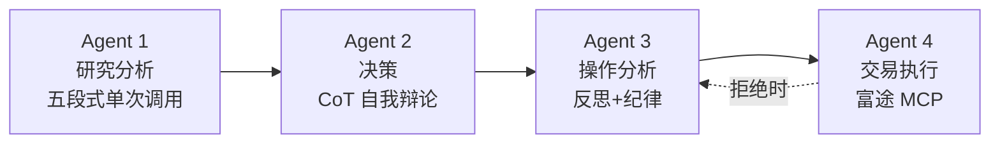

| # | Agent | 职责 | 模型 |
|---|---|---|---|
| **1** | 研究分析 Agent | 漏斗式研究：产业链筛选 → 公司初筛 → 深入研究（五段式仅对有价值公司执行） | Claude 3.5 Sonnet |
| **2** | 决策 Agent | CoT 自我辩论（正方→反方→综合），输出投资建议 + 共识等级 | Claude 3.5 Sonnet |
| **3** | 操作分析 Agent | 操作纪律评分、复盘总结、拒绝原因分析 | Claude 3.5 Sonnet |
| **4** | 交易执行 Agent | 富途 MCP 下单、持仓同步、T+1/涨跌停检查 | Python + 富途 MCP |

### 5.2 Agent 1: 研究分析 Agent（漏斗式）

#### 6P 设计

| P | 内容 |
|---|---|
| **Purpose** | 漏斗式筛选：全市场扫描有潜力的产业链 → 产业链内初筛候选公司 → 仅对有价值公司执行五段式深入研究 |
| **Persona** | 兼具白毛股神（产业链卡点审计）、孙宇晨（叙事泡沫探测）、Sicong 盲区检测三视角 |
| **Process** | 三层漏斗：产业链筛选 → 公司初筛 → 深入研究（五段式） |
| **Policy** | 五段式仅对通过初筛的"重点线索"公司执行；证据等级强制标注；D 级仅线索不作结论 |
| **Presentation** | 结构化 Markdown（L5 模板） |
| **Proof** | 自检：每个结论是否有证据支撑？证据等级是否标注？ |

#### 漏斗式研究流程

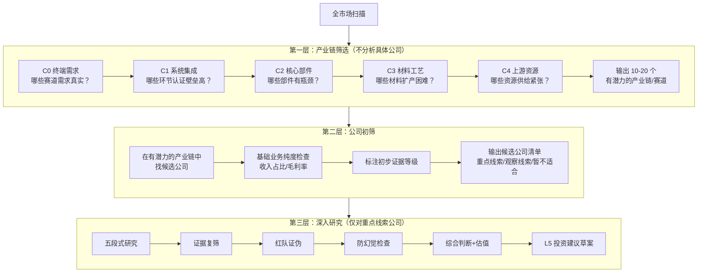

**关键设计**：五段式不是对每个股票都跑，而是漏斗的最后一层——只对通过产业链筛选和公司初筛的有价值公司执行。前两层是筛选过程，第三层才是深入研究。

#### 第一层：产业链筛选 Prompt

```
你是一个投资研究 Agent。当前分析的市场是：{market_config.market}

## 市场规则
- 交易制度：{market_config.settlement}
- 会计准则：{market_config.accounting_standard}
- 估值偏好：{market_config.valuation_preference}

## 已知信息
{market_context}

请按 C0-C4 框架筛选当前有潜力的产业链/赛道：

- C0 终端需求：哪些赛道的需求真实且持续 1-3 年？
- C1 系统集成：哪些环节认证壁垒高、集成难度大？
- C2 核心部件：哪些部件存在良率/产能瓶颈？
- C3 材料工艺：哪些材料扩产困难、设备有约束？
- C4 上游资源：哪些资源供给紧张？

输出 10-20 个有潜力的产业链/赛道，不分析具体公司。
```

#### 第二层：公司初筛 Prompt

```
基于以下有潜力的产业链，筛选候选公司：

## 有潜力的产业链
{promising_chains}

请对每个产业链：
1. 找出对应的候选公司
2. 检查近 4 季度主营业务是否与卡点相关
3. 检查收入占比、毛利率、订单、产能是否有公开披露
4. 标注初步证据等级（A=公告/B=调研/C=研报/D=社交媒体）

输出表格：公司|代码|对应产业链|对应环节|业务纯度|公开证据|证据等级|初步归类（重点线索/观察线索/暂不适合）
```

#### 第三层：深入研究 Prompt（五段式，仅对"重点线索"公司）

```
你对以下公司进行深入研究：{ticker}

## 公司初筛信息
{screening_result}

## 已知事实（标注证据等级）
{context_with_evidence_levels}

## 叙事领袖清单
{market_config.narrative_leaders}

请按以下五段式流程分析，在一个回答中完成全部五段：

### 第一段：产业链定位（C0-C4）
- 该公司在产业链中的定位
- 卡点环节确认
- 底层逻辑三问：需求是否真实？瓶颈在哪里？股票映射是否有证据？

### 第二段：证据复筛
- 逐条验证初筛阶段的证据
- 补充遗漏的证据
- 标注证据等级（A=公告/B=调研/C=研报/D=社交媒体）

### 第三段：红队证伪
- 大客户是否可能自研/二供/三供？
- 12-18 个月内是否可能被新技术替代？
- 同行是否可能打价格战？
- 收入是否真的来自卡点而非边缘业务？
- 当前市场是否已充分定价？

### 第四段：防幻觉检查
- 拎出可能夸大的结论
- 给出谨慎表达方式

### 第五段：综合判断
- DCF 估值（悲观/中性/乐观）
- 投资建议分类：重点建议 / 观察建议 / 暂不适合
- 买入假设与建仓方案
- 未来两季度跟踪表

## 证据等级说明
- A级 = 公告/年报（核心证据，可直接作结论）
- B级 = 调研/管理层交流（辅助判断，需交叉验证）
- C级 = 研报/媒体（仅参考，需 A/B 级支撑）
- D级 = 社交媒体（仅线索，不能作结论。叙事领袖除外）

请在分析时自然地给高等级证据更多权重。
D 级证据只能作为线索启发，不能作为结论依据。
```

#### L5 输出模板

```markdown
# L5_valuation: {TICKER}

## 底层逻辑三问
1. 需求是否真实？{回答}
2. 瓶颈在哪里？{回答}
3. 股票映射是否有证据？{回答}

## 产业链定位（C0-C4）
- C0 终端需求：{描述}
- C1 系统集成：{描述}
- C2 核心部件：{描述}
- C3 材料工艺：{描述}
- C4 上游资源：{描述}
- 卡点环节：{C?}
- 本公司定位：{描述}

## 证据表
| 事实 | 证据等级 | 来源 | 不能证明什么 |
|---|---|---|---|

## 红队证伪表
| 最大风险 | 证据能否缓解 | 还缺什么数据 | 风险等级 |
|---|---|---|---|

## 防幻觉检查表
| 可能被夸大的结论 | 为什么可能夸大 | 谨慎表达方式 |
|---|---|---|

## 估值
- 悲观 DCF：{WACC=12%, g=0%} → 内在价值 ${X}
- 中性 DCF：{WACC=10%, g=2%} → 内在价值 ${Y}
- 乐观 DCF：{WACC=8%, g=3%} → 内在价值 ${Z}
- 当前价格：${P}
- 安全边际：{百分比}

## 投资建议
- 分类：重点建议 / 观察建议 / 暂不适合
- 建议操作：买入 / 加仓 / 减仓 / 清仓 / HOLD
- 建议仓位：{X}%
- 建仓方案：{分批方案}
- 止损线：${S}
- 止盈线：${T}

## 买入假设（L6 锁定）
- 假设 1：{Q3 营收增速 > 10%}
- 假设 2：{毛利率不低于 43%}

## 未来两季度跟踪表
| 时间 | 跟踪指标 | 阈值 | 触发动作 |
|---|---|---|---|
| 2026Q3 | 营收增速 | > 10% | 低于则减仓 |
| 2026Q3 | 毛利率 | > 43% | 低于则警报 |
```

### 5.3 Agent 2: 决策 Agent（CoT 自我辩论）

#### 6P 设计

| P | 内容 |
|---|---|
| **Purpose** | 对 Agent 1 的 L5 草案进行 CoT 自我辩论，输出最终投资建议 + 共识等级 |
| **Persona** | 同时扮演主提案方（IA#1）和魔鬼代言人（IA#2） |
| **Process** | CoT 三步：正方论证 → 反方反驳 → 综合判断 |
| **Policy** | 必须先正后反再综合；反方至少 3 个实质性反驳；无 A 级证据→仓位衰减 50%；"暂不适合"→强制 HOLD |
| **Presentation** | 结构化 Markdown（决策报告） |
| **Proof** | 自检：正反双方观点是否都基于证据？共识等级是否合理？ |

#### CoT 自我辩论流程

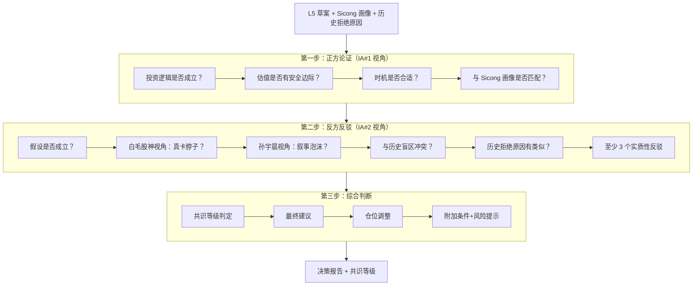

#### CoT Prompt 模板

```
你是一个投资决策 Agent。你需要对以下研究草案进行自我辩论，最终给出投资建议。

## 研究草案（Agent 1 产出）
{l5_draft}

## Sicong 个人画像
{sicong_profile}

## 历史拒绝原因（快速反馈循环）
{rejection_reasons}

## 叙事领袖清单
{narrative_leaders}

请按以下三步进行自我辩论：

### 第一步：正方论证（IA#1 视角）
假设你是主提案方，论证为什么 Sicong 应该执行这个建议：
- 投资逻辑是否成立？
- 估值是否有安全边际？
- 时机是否合适？
- 与 Sicong 画像是否匹配？

### 第二步：反方反驳（IA#2 视角）
假设你是魔鬼代言人，逐条审查正方论证的漏洞：
- 假设是否成立？有没有忽略的风险？
- 白毛股神视角：这家公司真的是卡脖子件吗？
- 孙宇晨视角：这是叙事泡沫还是真实基本面驱动？
- 是否与 Sicong 历史盲区冲突？
- 历史拒绝原因中是否有类似情况？
- 必须提出至少 3 个实质性反驳

### 第三步：综合判断
基于正反双方观点，给出最终判断：
- 共识等级：🟢 高共识 / 🟡 有条件共识 / 🟠 存在争议 / 🔴 强烈反对
- 最终建议：买入 / 加仓 / 减仓 / 清仓 / HOLD
- 仓位调整：{如有衰减，说明原因}
- 附加条件：{如有}
- 风险提示：{如有}
```

#### 共识等级判定

| 共识等级 | 条件 | 推送行为 | 标签 |
|---|---|---|---|
| 🟢 **高共识** | 正方论证充分，反方无法提出实质性反驳 | 立即推送，强烈建议执行 | `强推` |
| 🟡 **有条件共识** | 正方论证成立，但反方提出需附加条件 | 推送，同时展示附加条件与风险提示 | `有条件同意` |
| 🟠 **存在争议** | 反方提出重大异议，正方无法完全反驳 | 两方观点同时呈现，Sicong 做最终裁决 | `存在争议` |
| 🔴 **强烈反对** | 反方发现致命逻辑缺陷 | 暂不推送，等待新数据窗口重新评估 | `拦截待观望` |

### 5.4 Agent 3: 操作分析 Agent

| P | 内容 |
|---|---|
| **Purpose** | 记录操作纪律评分、定期复盘、分析拒绝原因并回写 Context |
| **Persona** | 严格的投资纪律审计员 |
| **Process** | 每笔操作后记录纪律评分 → 每季度复盘总结 → 每次拒绝后分析原因并回写 |
| **Policy** | 遵循系统建议 +1 分；被警告仍坚持 -1 分；拒绝原因必须回写 Context |
| **Presentation** | 结构化 Markdown（L7 日志） |
| **Proof** | 自检：评分是否客观？拒绝原因是否可操作？ |

### 5.5 Agent 4: 交易执行 Agent

| P | 内容 |
|---|---|
| **Purpose** | 通过富途 MCP 执行交易、同步持仓、检查市场规则 |
| **Persona** | 交易执行引擎，严格遵循市场规则 |
| **Process** | 接收决策 → 市场规则检查 → 富途 MCP 下单 → 同步持仓 → 写入 L7 |
| **Policy** | A 股 T+1 检查；A 股涨跌停检查；高风险操作二次确认；紧急熔断直接推送 |
| **Presentation** | JSON（交易结果） |
| **Proof** | 自检：订单是否成功？持仓是否同步？L7 是否写入？ |

---

## 6. Context 层 — RAG 检索与上下文装配

### 6.1 RAG 检索流程

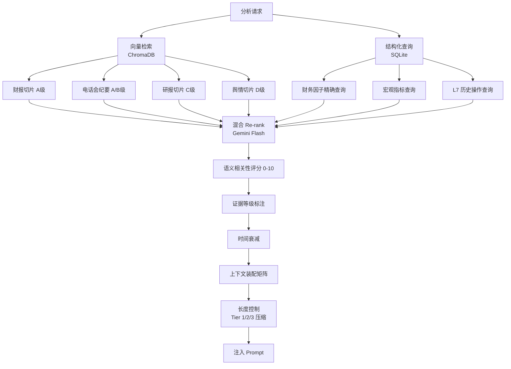

### 6.2 上下文装配矩阵

| 场景 | 注入内容 | 长度预算 |
|---|---|---|
| **深度研究** | L2 全部事实 + L4 产业链图谱 + L3 画像 + L7 历史相似案例 + L5 历史拒绝原因 | 100K tokens |
| **实时咨询** | L2 核心事实 + L5 当前估值 + L6 当前假设 + L3 画像 | 30K tokens |
| **持仓监控** | L6 阈值 + L2 最新事实 + 实时行情 | 10K tokens |
| **趋势预测** | L2 历史因子 + L4 宏观乘数 + L3 大佬画像 | 20K tokens |

### 6.3 快速反馈循环

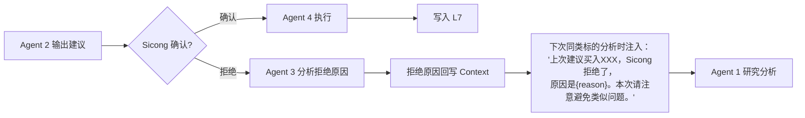

**这是系统最重要的学习机制**——每次拒绝都让系统变得更聪明，比任何 Guardrails 都有效。

### 6.4 证据等级标注

证据等级标注在 Context 中，不硬编码权重，完全交给 LLM 判断。

**初版不设任何软引导**，保留配置入口供后期添加：

```yaml
# config/evidence_weights.yaml（初版为空）
enabled: false
# 后期可启用软引导：
# enabled: true
# guidance:
#   A: "核心证据，通常占判断权重 60-80%"
#   B: "辅助证据，通常占 15-30%"
#   C: "参考信息，通常占 5-15%"
#   D: "仅线索，不参与权重计算"
```

Context 中的事实标注格式：

```
## 已知事实（标注证据等级）

- (A级, 2026-06-18) 该公司 2025Q4 营收 50 亿，同比 +18% <- [2025年报#P12]
- (B级, 2026-05-20) 管理层在调研中表示 H2 产能将翻倍 <- [调研纪要#P3]
- (C级, 2026-06-10) 中信研报预测明年净利润 +30% <- [中信研报]
- (D级, 2026-06-15) 孙哥在推特上说这个赛道要爆发 <- [Twitter]（叙事领袖）
```

| 等级 | 含义 | 处理方式 |
|---|---|---|
| **A** | 公告 / 年报 | 核心证据，可直接作结论 |
| **B** | 调研 / 管理层交流 | 辅助判断，需交叉验证 |
| **C** | 研报 / 媒体 | 仅参考，需 A/B 级支撑 |
| **D** | 社交媒体 | 仅线索，不能作结论（叙事领袖除外） |

---

## 7. Harness 层 — 工作流·Guardrails

### 7.1 Guardrails 分级

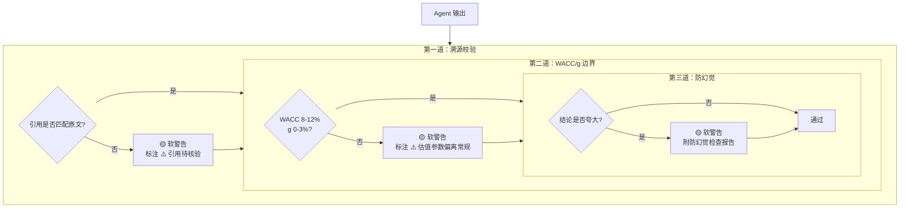

| Guardrail | 类型 | 行为 | 理由 |
|---|---|---|---|
| **第一道：溯源校验** | 🟡 软警告 | 不拦截，标注 `⚠️ 引用待核验` | 引用格式多变，正则误判率高 |
| **第二道：WACC/g 边界** | 🟡 软警告 | 不拦截，标注 `⚠️ 估值参数偏离常规` | 参数偏离时提醒 Sicong 关注，但不强制重算 |
| **第三道：防幻觉** | 🟡 软警告 | 不拦截，附防幻觉检查报告 | 判断题不是数学题，LLM 标注比正则拦截更有用 |

**设计理念**：所有 Guardrails 均为软警告，不阻塞 Agent 输出。真正的安全网是 Sicong 的人工确认。Guardrails 的作用是提供更多信息让 Sicong 做判断，而不是替 Sicong 做决定。

### 7.2 共识门禁机制

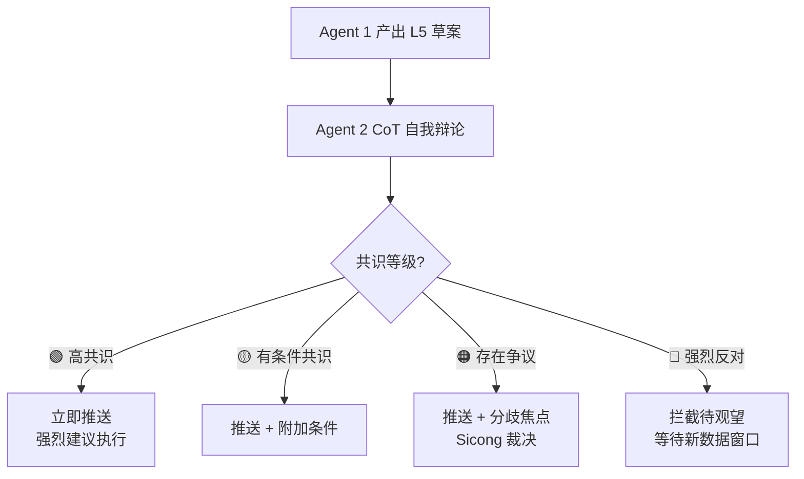

### 7.3 慢循环完整工作流

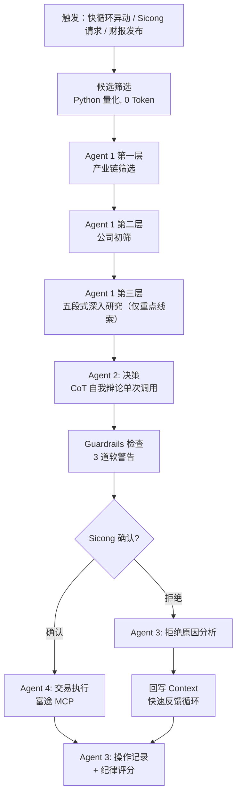

### 7.4 投资建议书（最终输出模板）

投资建议书是系统交付给 Sicong 的**唯一正式文档**——即"策略说明书"。它由 WorkflowOrchestrator 在 Agent 2 决策 + Guardrails 检查之后装配，是 Sicong 确认/拒绝的唯一依据。L5 研究草案、CoT 辩论原文、Guardrails 警告均作为附件引用，建议书本身只保留 Sicong 决策所需的核心信息。

#### 装配流程

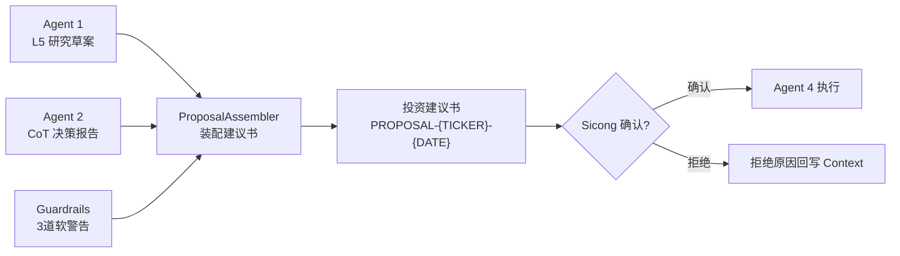

#### 投资建议书模板

```markdown
# 投资建议书 PROPOSAL-{TICKER}-{YYYYMMDD}

## 一、核心结论（30秒速览）
- 标的：{TICKER}（{公司全称}）
- 市场：{US/CN}
- 建议操作：{买入/加仓/减仓/清仓/HOLD}
- 建议仓位：{X}%
- 共识等级：{🟢高共识 / 🟡有条件共识 / 🟠存在争议 / 🔴强烈反对}
- 安全边际：{百分比}
- 一句话逻辑：{为什么买/卖，不超过50字}

## 二、研究摘要（L5 精简版）
### 底层逻辑三问
1. 需求是否真实？{结论}
2. 瓶颈在哪里？{结论}
3. 股票映射是否有证据？{结论}

### 产业链定位（C0-C4）
- 卡点环节：{C?}
- 本公司定位：{描述}
- 业务纯度：{卡点业务收入占比}

### 证据强度
- A级证据：{N}条（公告/年报）
- B级证据：{N}条（调研/管理层）
- C级证据：{N}条（研报/媒体）
- D级证据：{N}条（社交媒体，仅线索）
- 是否有A级核心证据支撑主逻辑：{是/否}

## 三、估值摘要
| 情景 | WACC | g | 内在价值 | vs 当前价格 |
|---|---|---|---|---|
| 悲观 | 12% | 0% | ${X} | {折价/溢价} |
| 中性 | 10% | 2% | ${Y} | {折价/溢价} |
| 乐观 | 8% | 3% | ${Z} | {折价/溢价} |

- 当前价格：${P}
- 安全边际（中性）：{百分比}

## 四、CoT 辩论摘要
### 正方核心论点（IA#1）
1. {论点1}
2. {论点2}
3. {论点3}

### 反方核心反驳（IA#2，至少3条）
1. {反驳1}
2. {反驳2}
3. {反驳3}

### 综合判断
{正反双方如何权衡，为何达成此共识等级}

## 五、Guardrails 检查结果
| 检查项 | 结果 | 说明 |
|---|---|---|
| 溯源校验 | ✅通过 / ⚠️软警告 | {说明} |
| WACC/g 边界 | ✅通过 / ⚠️软警告 | {说明} |
| 防幻觉检查 | ✅通过 / ⚠️软警告 | {说明} |

> 所有 Guardrails 均为软警告，不阻塞。⚠️ 项请 Sicong 特别关注。

## 六、建仓方案
- 建议仓位：{X}%
- 分批方案：{如：第一批50%立即执行，第二批50%待Q3财报后}
- 止损线：${S}（{百分比}）
- 止盈线：${T}（{百分比}）
- 建仓周期：{如：2周内完成}

## 七、跟踪假设（L6 锁定）
| # | 假设 | 跟踪指标 | 阈值 | 触发动作 | 检查时点 |
|---|---|---|---|---|---|
| 1 | {Q3营收增速>10%} | 营收增速 | >10% | 低于则减仓 | 2026Q3财报 |
| 2 | {毛利率不低于43%} | 毛利率 | >43% | 低于则警报 | 2026Q3财报 |

## 八、风险提示
1. {风险1}
2. {风险2}
3. {风险3}

## 九、Sicong 确认区
- [ ] 确认执行（按建仓方案）
- [ ] 确认执行（调整仓位至____%）
- [ ] 拒绝
  - 拒绝原因：____________________
  - （拒绝原因将由 Agent 3 分析并回写 Context，下次同类分析时注入）

---
附件：
- [L5 研究草案完整版]({vault_path})
- [CoT 辩论原文]({vault_path})
- [Guardrails 详细报告]({vault_path})
```

#### 设计要点

| 要点 | 说明 |
|---|---|
| **唯一交付物** | Sicong 只看这一份文档做决策，不需要翻阅 L5/CoT 原文 |
| **30秒速览** | 第一节"核心结论"让 Sicong 快速判断是否值得细看 |
| **证据强度量化** | 明确展示 A/B/C/D 各级证据条数，是否有关键 A 级支撑 |
| **CoT 摘要而非全文** | 只保留正反各3条核心论点，全文作为附件 |
| **Guardrails 透明** | 软警告结果全部展示，⚠️ 项提醒 Sicong 关注 |
| **跟踪假设可执行** | L6 假设直接写成表格，阈值和触发动作明确 |
| **拒绝原因结构化** | 拒绝时填写原因，回写 Context 形成快速反馈循环 |
| **附件可溯源** | L5/CoT/Guardrails 原文存 Vault，需要时可深入查看 |

#### Sicong 交互界面（推送 + 详情按钮）

系统推送决策给 Sicong 时，采用**"摘要推送 + 详情查看"**两级交互模式：

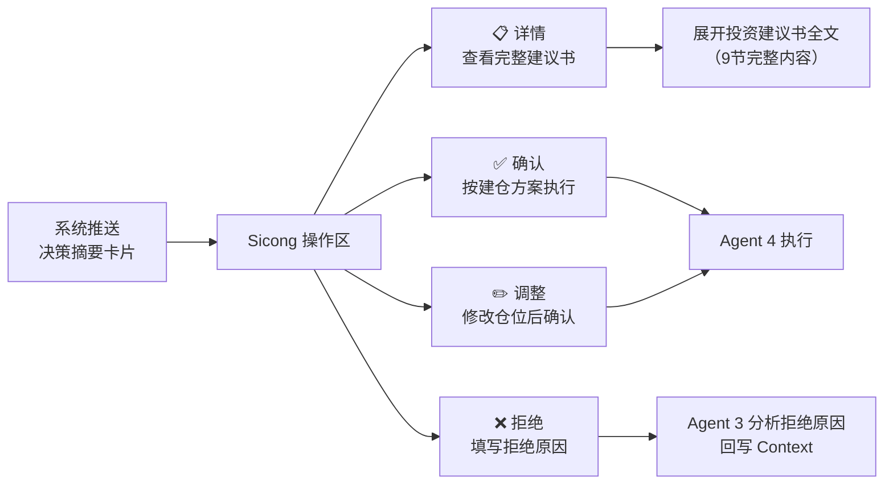

**推送卡片（摘要）**——Sicong 第一眼看到的内容：

```
┌─────────────────────────────────────────────┐
│  📊 NVDA 买入建议    🟢 高共识              │
│  建议仓位 8%  安全边际 22.3%                │
│  一句话逻辑：AI算力卡点，GPU产能瓶颈        │
│  ⚠️ 1项软警告（WACC偏离）                   │
│                                             │
│  [📋 详情]  [✅ 确认]  [✏️ 调整]  [❌ 拒绝]  │
└─────────────────────────────────────────────┘
```

**详情按钮行为**：

| 操作 | 行为 |
|---|---|
| 📋 **详情** | 展开投资建议书全文（7.4 节模板的 9 节完整内容），含 CoT 辩论摘要、Guardrails 结果、建仓方案、跟踪假设等。Sicong 查看后返回卡片做决策 |
| ✅ **确认** | 按建仓方案执行，Agent 4 下单 |
| ✏️ **调整** | Sicong 可修改仓位百分比后确认执行 |
| ❌ **拒绝** | 弹出拒绝原因输入框，提交后 Agent 3 分析并回写 Context |

**设计理念**：Sicong 默认只看摘要卡片即可决策（30秒）；需要深入时点"详情"查看完整建议书。避免信息过载，同时保证可溯源。

#### 与人工确认门禁的关系

投资建议书对应第 11 章人工确认门禁清单中的第 2 项（Agent 2 买入建议）和第 8 项（卖出建议）。其他门禁项（如紧急熔断、涨跌停特殊处理）使用简化版推送，不走完整建议书流程。

---

## 8. 业务生命周期设计

### 8.1 全生命周期流程

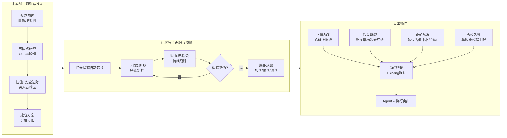

### 8.2 卖出触发场景

| 触发类型 | 触发条件 | 建议操作 |
|---|---|---|
| **止损触发** | 价格跌破设定止损线（如 -12%） | 建议立即清仓 |
| **假设断裂** | 财报指标跌破买入红线（如营收增速 < 10%） | 建议减仓/清仓 |
| **止盈触发** | 价格超过估值中枢 30%+，进入高估区间 | 建议分批止盈 |
| **仓位失衡** | 大涨导致单股仓位超出上限 | 建议减仓至上限内 |

**紧急熔断例外**：价格跌破止损线超过 5%，无需共识投票，直接推送红色硬止损警报。

**卖出操作同样经过 Agent 2 的 CoT 自我辩论**——不是系统单方面说卖就推，反方审查通过才推送 Sicong 确认。

---

## 9. 投资决策质量鱼骨图

影响投资决策质量的关键因素分析：

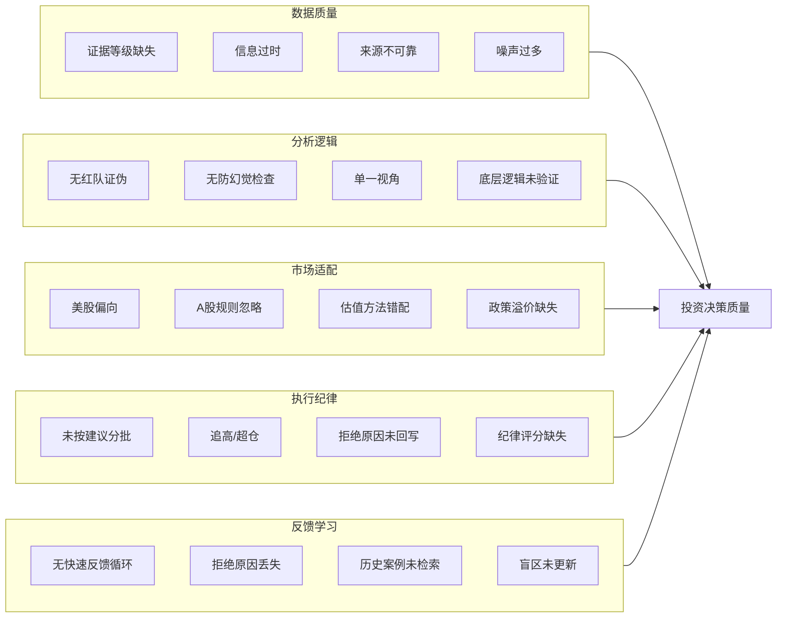

**本系统针对每个因素的设计对策：**

| 因素 | 问题 | 系统对策 |
|---|---|---|
| **数据质量** | 证据等级缺失 | L2 强制标注 A/B/C/D 证据等级 |
| **数据质量** | 信息过时 | RAG 时间衰减 + L6 跟踪表 |
| **数据质量** | 来源不可靠 | 证据等级体系 + D 级仅线索 |
| **分析逻辑** | 无红队证伪 | 五段式第三段：红队证伪 5 问 |
| **分析逻辑** | 无防幻觉检查 | 五段式第四段：防幻觉检查 |
| **分析逻辑** | 单一视角 | 三脑视角（白毛股神+孙宇晨+盲区检测） |
| **分析逻辑** | 底层逻辑未验证 | 底层逻辑三问强制回答 |
| **市场适配** | 美股偏向 | Market Adapter 层 + 两套配置 |
| **市场适配** | A 股规则忽略 | A 股特殊规则配置（T+1/涨跌停/龙虎榜） |
| **市场适配** | 估值方法错配 | 市场配置估值偏好（DCF vs PE-Band） |
| **执行纪律** | 未按建议分批 | 操作纪律评分系统 |
| **执行纪律** | 追高/超仓 | 高风险操作二次确认门禁 |
| **反馈学习** | 无快速反馈 | 拒绝原因即时回写 Context |
| **反馈学习** | 历史案例未检索 | L7 元 RAG：IA 给建议前检索历史相似案例 |
| **反馈学习** | 盲区未更新 | AI 发现新盲区 → 画像更新提案 |

---

## 10. Sicong 强纠错保护机制

### 10.1 高风险操作二次确认门禁

默认选项为"取消执行"：

| 触发条件 | 说明 |
|---|---|
| 追高 | 价格高于估值中枢 15%+ 仍要买入 |
| 超仓 | 单股仓位超出设定上限 |
| 亏损加仓 | 持仓亏损 > 8% 还选择加仓 |
| 极度恐慌期操作 | VIX > 30 |

### 10.2 Sicong 个人画像盲区检测

- 包含：资金规模、风险边界、持仓上限、投资风格、历史盲区清单
- 首次启动时由 Agent 2 主动发起**对话式问卷**采集
- AI 发现新盲区时自动生成"画像更新提案"，Sicong 确认后追加

### 10.3 操作纪律评分系统

| 行为 | 评分 |
|---|---|
| 每次遵循系统建议 | +1 分 |
| 每次被警告仍坚持 | -1 分，记录案例及后续结果 |

定期向 Sicong 报告"本月操作纪律评分"与改进建议。

---

## 11. 人工确认门禁完整清单

| # | 确认触发条件 | 频率 | 严重程度 |
|---|---|---|---|
| 1 | 股票晋级核心池 A（B→A 提案） | 每周 0-3次 | ⚠️ 普通 |
| 2 | Agent 2 给出买入建议（共识 ≥ 有条件） | 每周 0-5次 | ⚠️ 普通 |
| 3 | L5 估值模型参数调整提案（财报后重算） | 每季度/每家 | ⚠️ 普通 |
| 4 | 持仓假设断裂 → 减仓/止损建议 | 不定期 | 🔴 重要 |
| 5 | 高风险操作二次确认门禁（Sicong 主动触发） | 触发时 | 🔴 重要 |
| 6 | Sicong 个人画像更新提案（AI 发现新盲区） | 不定期 | ⚠️ 普通 |
| 7 | 宏观乘数矩阵调整提案（宏观重大转折） | 每月 0-1次 | ⚠️ 普通 |
| 8 | 卖出建议（止损/止盈/假设断裂触发） | 不定期 | 🔴 重要 |
| 9 | 紧急熔断硬止损（无需共识，直接推送） | 触发时 | 🔴 紧急 |
| 10 | A 股涨跌停板特殊处理确认 | 触发时 | ⚠️ 普通 |
| 11 | 限售解禁预警确认（A 股） | 触发时 | ⚠️ 普通 |

---

## 12. Obsidian Vault 目录结构

```
touzi-agent-vault/
├── config/
│   ├── market-us.yaml           # 美股市场配置
│   ├── market-cn.yaml           # A股市场配置
│   ├── quant_config.yaml        # 量价趋势与流动性过滤参数
│   ├── macro_rules.yaml         # 宏观权重传导矩阵
│   └── evidence_weights.yaml    # 证据等级软引导配置（初版为空）
├── L3-profile/
│   ├── sicong.md                # Sicong 投资画像
│   ├── buffett.md               # 巴菲特模型
│   ├── druckenmiller.md         # 德鲁肯米勒模型
│   ├── serenity.md              # 白毛股神模型
│   ├── justin_sun.md            # 孙宇晨模型
│   ├── market-us.md             # 美股市场画像
│   └── market-cn.md             # A股市场画像
├── _inbox/                      # 手动投喂区（PDF财报/分析网页/纪要）
├── Stage_C_Market/
│   ├── macro_indicators.md      # 全球宏观核心指标看板
│   └── sector_momentum.md       # 大盘板块量价修正排序
├── Stage_B_Sectors/
│   └── <Sector_Name>/
│       ├── sentiment.md         # 行业舆情情感分析
│       └── candidate_stocks.md  # 板块内强势候选股
├── Stage_A_Watchlist/
│   ├── watchlist.json           # 持仓状态白名单
│   └── <Ticker>/
│       ├── L1_raw/              # 原始数据切片
│       ├── L2_facts/            # 标准因子（含证据等级）
│       ├── L4_bottleneck_map.md # 产业链卡点图谱
│       └── L5_valuation.md      # 投资建议 + 估值 + 假设
├── L7_trade_log/                # 操作日志（含拒绝原因）
├── proposals/                   # 待审核提案临时区
└── archive/                     # 历史提案决策归档
```

---

## 13. 数据源完整清单

### 13.1 美股数据源

| 数据类别 | 具体内容 | 证据等级 | 获取方式 | 更新频率 |
|---|---|---|---|---|
| 公司公告 | 10-K/10-Q/8-K/招股书 | A | SEC EDGAR API | 每季度 |
| 财报电话会 | Q&A 环节全文 | A/B | Seeking Alpha / 官方 IR | 每季度 |
| 管理层言论 | CEO/CFO 访谈、股东信 | B | 新闻爬取 / 手动投喂 | 不定期 |
| 机构持仓 | 13F 披露 | B | SEC EDGAR API | 每季度 |
| 产业链情报 | 机构调研、供应链信息 | B | 手动投喂 + AI 提炼 | 不定期 |
| 卖方研报 | GS/MS 等券商研报 | C | 手动投喂 / RSS | 不定期 |
| 财经新闻 | 财经媒体全文 | C | RSS / 爬虫 | 每日 |
| 社交媒体 | Twitter/Reddit | D | Twitter API / RSS | 每日 |
| 宏观政策 | FOMC/CPI/GDP/PMI | A/B | 官方 API / RSS | 每月 |
| 实时行情 | 价格/成交量 | A | 富途 MCP / Yahoo Finance | 实时 |
| 系统历史 | L7 操作日志 | A | 自动写入 | 实时 |

### 13.2 A 股数据源

| 数据类别 | 具体内容 | 证据等级 | 获取方式 | 更新频率 |
|---|---|---|---|---|
| 公司公告 | 年报/季报/临时公告 | A | 巨潮资讯网 API | 每季度 |
| 调研纪要 | 机构调研纪要 | B | 巨潮 / 东方财富 | 不定期 |
| 管理层言论 | 高管访谈、新闻稿 | B | 新闻爬取 / 手动投喂 | 不定期 |
| 北向资金 | 外资持仓变动 | B | 东方财富 API | 每日 |
| 融资融券 | 多空数据 | B | 交易所 API | 每日 |
| 龙虎榜 | 机构席位追踪 | B | 交易所 API | 每日 |
| 卖方研报 | 券商研报 | C | 手动投喂 / RSS | 不定期 |
| 财经新闻 | 财经媒体全文 | C | RSS / 爬虫 | 每日 |
| 社交媒体 | 微博/雪球/论坛 | D | API / 爬虫 | 每日 |
| 宏观政策 | 央行/统计局/证监会 | A/B | 官方 API / RSS | 每月 |
| 实时行情 | 价格/成交量 | A | 富途 MCP / 东方财富 | 实时 |
| 限售解禁 | 解禁日期与规模 | A | 交易所公告 | 触发时 |
| 系统历史 | L7 操作日志 | A | 自动写入 | 实时 |

---

## 14. 系统验证与测试方案

### 14.1 单元测试

| 测试对象 | 测试内容 |
|---|---|
| 量价过滤脚本 | 均线/成交量/流动性过滤逻辑正确性 |
| Guardrails 分级 | 3 道软警告正确标注，不阻塞输出 |
| Market Adapter | US/CN 配置切换正确，适配器加载正确 |
| 证据等级标注 | L2 事实正确标注 A/B/C/D |
| 共识投票聚合 | CoT 辩论结果正确映射到 4 级共识 |

### 14.2 联调测试

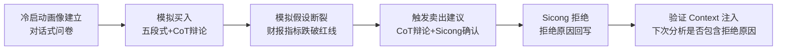

### 14.3 多市场测试

| 测试场景 | 验证内容 |
|---|---|
| 美股标的运行 | US 配置加载正确，SEC EDGAR 数据获取正常 |
| A 股标的运行 | CN 配置加载正确，巨潮数据获取正常 |
| A 股 T+1 检查 | 当日买入不可卖出 |
| A 股涨跌停 | 达到涨跌停板时交易被拦截 |
| 同一标的双市场 | 核心逻辑一致，仅配置差异 |

### 14.4 安全测试

| 测试场景 | 验证内容 |
|---|---|
| 超仓操作 | 二次确认门禁拦截，默认选项为"取消" |
| 追高操作 | 价格高于估值中枢 15%+ 时触发警告 |
| 紧急熔断 | 止损线超过 5% 跌幅时直接推送红色警报 |

---

## 15. 回测模式（Point-in-Time Backtesting）

### 15.1 定位

回测模式是系统的**经验性验证机制**——用历史数据检验策略是否真的有效。复用现有 4 Agent 管线，新增 Point-in-Time 数据过滤 + 性能评估。

### 15.2 架构

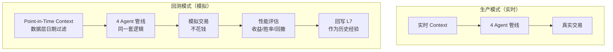

### 15.3 Point-in-Time 数据过滤

**只在数据层做时间过滤，不在 Prompt 中限制 LLM。** LLM 自然地基于提供的 Context 分析和回忆，不需要额外约束。

```python
class PointInTimeFilter:
    """回测模式专用：数据层过滤指定日期之后的所有数据"""

    def filter_context(self, context, as_of_date):
        # L1/L2 事实：只保留 as_of_date 之前的
        context["l2_facts"] = [f for f in context["l2_facts"] if f.date <= as_of_date]

        # RAG 检索：添加日期过滤
        context["rag_results"] = self.rag.search(
            query=context["query"],
            filter={"date": {"$lte": as_of_date}}
        )

        # L7 历史：只保留 as_of_date 之前的操作
        context["l7_history"] = [h for h in context["l7_history"] if h.date <= as_of_date]

        return context
```

### 15.4 回测执行流程

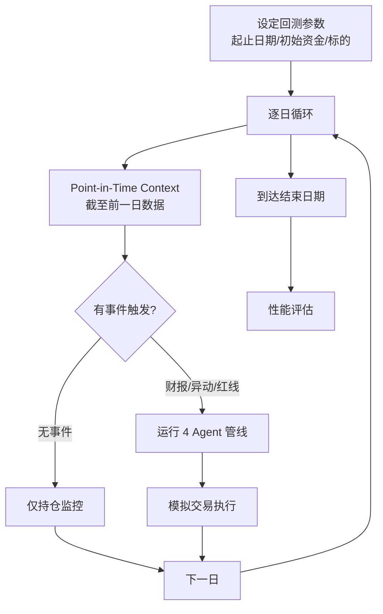

### 15.5 事件驱动机制（控制成本）

不对每个股票每天都跑完整漏斗，而是事件驱动：

| 事件类型 | 触发条件 | 执行内容 |
|---|---|---|
| 财报发布 | 季度财报发布日 | 运行完整漏斗（产业链筛选→公司初筛→深入研究） |
| 价格异动 | 单日涨跌幅 > ±5% | 运行 Agent 2 决策（基于已有 L5） |
| 假设红线触发 | L6 假设指标跌破红线 | 运行 Agent 2 决策（卖出评估） |
| 无事件 | 无上述事件 | 仅运行持仓监控（Python，0 Token） |

### 15.6 性能评估指标

| 指标 | 说明 |
|---|---|
| **总收益率** | 模拟期间整体收益 |
| **超额收益** | 相对基准（美股 S&P 500 / A 股沪深 300）的超额 |
| **最大回撤** | 模拟期间最大亏损幅度 |
| **胜率** | 盈利建议数 / 总建议数 |
| **共识等级准确度** | 🟢高共识建议的胜率 vs 🟠争议建议的胜率 |
| **纪律评分对比** | 遵循系统建议 vs 随机操作的收益差 |

### 15.7 回测结果回写

回测结果回写 L7，作为"历史经验"供生产模式的 Agent 检索：

```markdown
# 回测记录 BACKTEST-2026-05-01-to-2026-06-01

## 参数
- 起止日期: 2026-05-01 至 2026-06-01
- 初始资金: $100,000
- 标的: AAPL, NVDA, TSLA
- 基准: S&P 500

## 结果
- 总收益率: +8.2%
- 基准收益: +3.1%
- 超额收益: +5.1%
- 最大回撤: -4.3%
- 胜率: 67%（4/6 建议盈利）
- 共识准确度: 🟢高共识胜率 80% vs 🟠争议胜率 33%

## 经验教训
- 高共识建议的胜率显著高于争议建议，验证了 CoT 自我辩论机制有效
- NVDA 建议被拒绝（估值过高），后续涨幅 +15%，说明对成长股估值可能过于保守
- 回写 L7 供生产模式检索
```

---

## 16. 策略修正机制

系统通过 4 个时间尺度的修正机制持续进化：即时修正（秒级）→ 操作后修正（分钟级）→ 回测修正（小时级）→ 季度策略审视（季度）。

### 16.1 修正机制总览

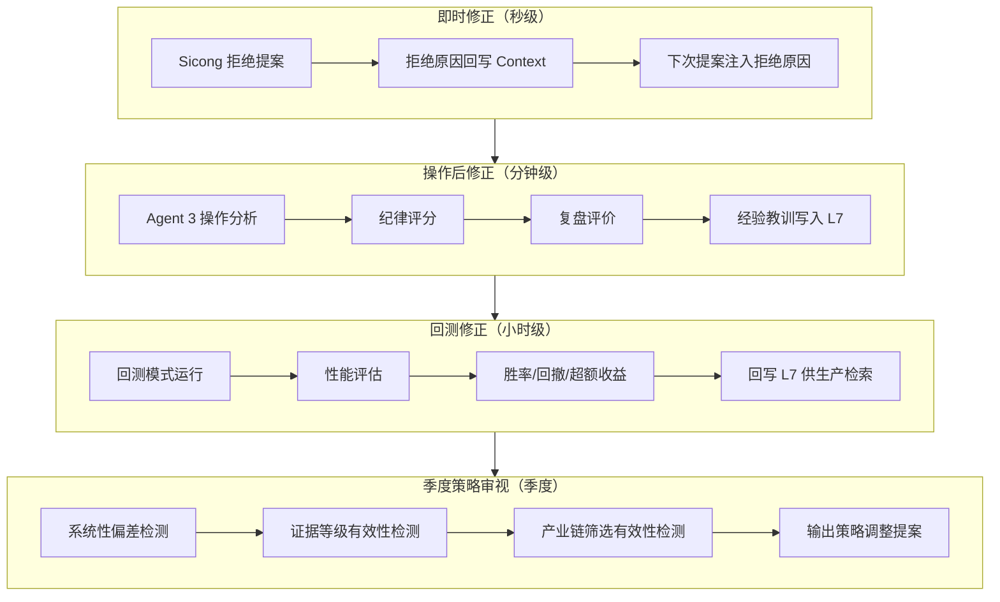

| 修正环节 | 触发时机 | 修正内容 | 位置 |
|---|---|---|---|
| **即时修正** | Sicong 拒绝提案时 | 拒绝原因回写 Context，下次提案注入 | 6.3 快速反馈循环 |
| **操作后修正** | 每笔操作完成后 | 纪律评分、复盘评价、经验教训 | 5.4 Agent 3 |
| **回测修正** | 回测模式运行后 | 胜率/回撤分析、共识准确度验证 | 15.7 回测结果回写 |
| **季度策略审视** | 每季度/每次平仓 | 系统性偏差检测、策略调整提案 | 16.4 季度策略审视 |

### 16.2 即时修正（快速反馈循环）

**触发**：Sicong 拒绝 Agent 2 的投资建议时。

**流程**：
1. Agent 3 分析拒绝原因（"估值过于乐观"/"赛道不对"/"时机不好"等）
2. 拒绝原因回写 Context
3. 下次同类标的分析时，Context 自动注入："上次你建议买入 XXX，Sicong 拒绝了，原因是 {reason}。本次请注意避免类似问题。"

**详见**：6.3 快速反馈循环

### 16.3 操作后修正（Agent 3）

**触发**：每笔操作（买/卖/加/减仓）完成后。

**流程**：
1. 记录操作纪律评分（遵循建议 +1 分 / 被警告仍坚持 -1 分）
2. 生成复盘评价（3 个月后自动触发：价格表现、假设是否证伪、操作评价）
3. 经验教训写入 L7
4. 新归纳的经验追加到 `sicong.md` 的"已验证认知"与"已验证盲区"

**详见**：5.4 Agent 3 + L7 操作记录格式（3.4）

### 16.4 季度策略审视（主动修正）

**触发**：每季度末或每次平仓后。由 Agent 3 主动触发。

**与前三者的区别**：前三个修正机制是**被动修正**（等拒绝/等操作完成/等回测结束才学）。季度策略审视是**主动修正**——系统主动审视自身表现，发现系统性偏差，提出调整建议。

#### 16.4.1 系统性偏差检测

| 检测项 | 检测方法 | 异常信号 | 调整方向 |
|---|---|---|---|
| **CoT 辩论有效性** | 🟢高共识建议胜率 vs 🟠争议建议胜率 | 高共识胜率 ≤ 争议胜率 | CoT Prompt 可能失效，需调整反方反驳深度 |
| **保守度偏差** | 被拒绝建议的事后表现 | 拒绝的建议事后大量赚钱 | 系统过于保守，估值方法需放宽 |
| **激进度偏差** | 被接受建议的事后表现 | 接受的建议事后大量亏钱 | 系统过于激进，安全边际需提高 |
| **证据等级有效性** | A级证据建议胜率 vs C/D级证据建议胜率 | 无显著差异 | 证据等级标注可能无效，需加强标注质量 |
| **产业链筛选有效性** | 第一层筛选出的产业链后续表现 | 大量筛选出的产业链走弱 | C0-C4 筛选逻辑需调整 |

#### 16.4.2 证据等级有效性检测

| 检测项 | 检测方法 | 异常信号 | 调整方向 |
|---|---|---|---|
| **A 级证据价值** | A 级证据支撑的建议 vs 无 A 级证据的建议，胜率差异 | 无差异 | 证据等级可能流于形式 |
| **D 级证据风险** | D 级证据（非叙事领袖）支撑的建议胜率 | D 级胜率异常高 | 可能存在幸存者偏差，需加强 D 级限制 |
| **叙事领袖有效性** | 叙事领袖线索的后续表现 | 叙事领袖线索无超额收益 | 叙事领袖清单需更新 |

#### 16.4.3 产业链筛选有效性检测

| 检测项 | 检测方法 | 异常信号 | 调整方向 |
|---|---|---|---|
| **第一层准确率** | 筛选出的产业链中，后续走强的比例 | < 40% | C0-C4 筛选标准需收紧 |
| **第二层准确率** | 初筛"重点线索"公司中，后续跑赢行业的比例 | < 50% | 公司初筛标准需调整 |
| **第三层深度价值** | 深入研究后给出"重点建议"的公司，后续表现 | 胜率 < 50% | 五段式研究流程需优化 |

#### 16.4.4 策略调整提案

基于以上检测结果，Agent 3 输出"策略调整提案"给 Sicong 确认：

```markdown
# 策略调整提案 STRATEGY-REVIEW-2026Q2

## 检测结果

### 1. CoT 辩论有效性
- 🟢高共识建议胜率: 75%（6/8）
- 🟠争议建议胜率: 40%（2/5）
- 结论: ✅ 有效，高共识建议显著优于争议建议

### 2. 保守度偏差
- 被拒绝建议 3 条，事后表现: 2 条盈利（+12%, +8%），1 条亏损（-5%）
- 结论: ⚠️ 系统对成长股估值可能过于保守，拒绝的 2 条事后盈利

### 3. 证据等级有效性
- A级证据建议胜率: 70%
- C/D级证据建议胜率: 45%
- 结论: ✅ 有效，A级证据建议显著优于C/D级

### 4. 产业链筛选有效性
- 第一层筛选 15 个产业链，后续走强 9 个（60%）✅
- 第二层"重点线索"8 家公司，跑赢行业 5 家（63%）✅

## 策略调整建议

### 建议 1: 成长股估值调整
- 问题: 对成长股（营收增速 > 30%）估值过于保守，WACC 偏高
- 建议: 成长股 WACC 上限从 12% 调整到 10%
- 预期影响: 减少对高增长公司的误拒

### 建议 2: 叙事领袖清单更新
- 问题: 孙宇晨线索后续表现差（1/4 盈利）
- 建议: 将孙宇晨从"叙事领袖"降级为"普通 D 级信源"
- 预期影响: 减少叙事泡沫误判

## Sicong 确认
- [ ] 接受建议 1
- [ ] 接受建议 2
- [ ] 全部拒绝
- [ ] 部分接受（请说明）
```

#### 16.4.5 策略调整执行

Sicong 确认后，调整写入对应配置：

| 调整类型 | 写入位置 | 生效范围 |
|---|---|---|
| WACC/g 范围调整 | `market-us.yaml` / `market-cn.yaml` | 下次 Agent 1 估值时 |
| 叙事领袖清单更新 | `market-us.yaml` / `market-cn.yaml` | 下次 Agent 1 研究时 |
| CoT Prompt 调整 | Agent 2 Prompt 模板 | 下次 Agent 2 决策时 |
| 产业链筛选标准调整 | Agent 1 第一层 Prompt | 下次 Agent 1 研究时 |

**所有调整记录写入 L7**，作为策略演进历史供未来检索。
